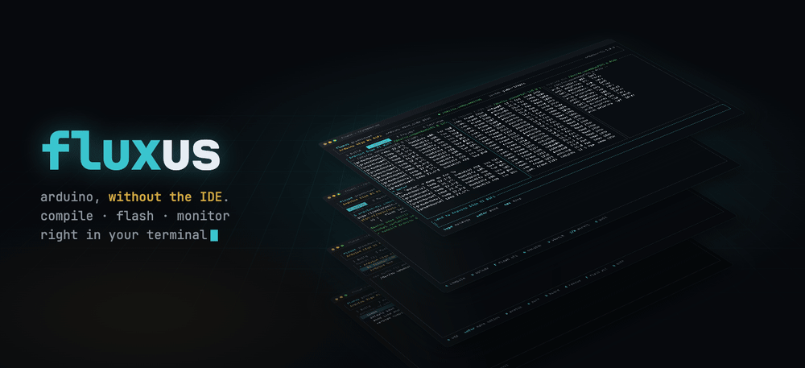
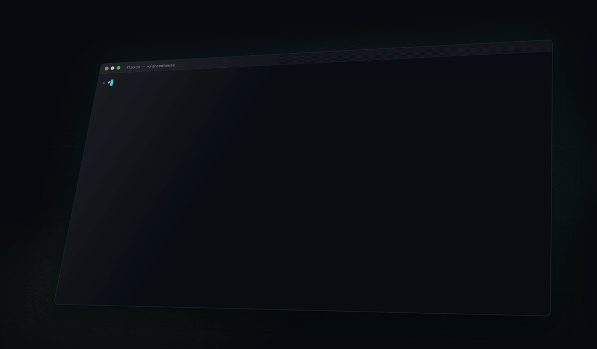
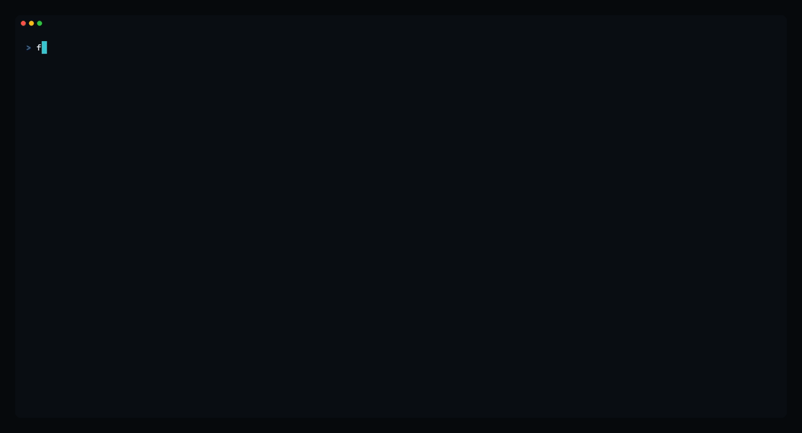
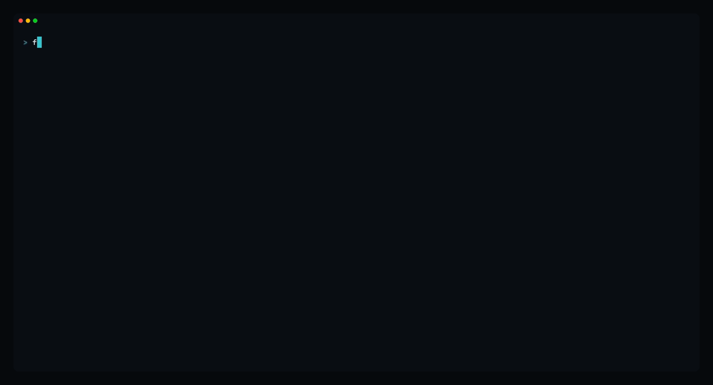

<p align="center">
  
</p>

fluxus is a terminal UI for Arduino. It wraps `arduino-cli` so you can compile, upload and use the serial monitor without the Arduino IDE or VS Code. It's for people who write code in some other editor (Zed, Neovim, Helix...) and keep a terminal open next to it.

<p align="center">
  
</p>

## What it does

- Keeps several boards in one project, each with its own sketch and port
- Shows boards as you plug them in, so you can add them with one key
- Compiles and uploads, or flashes every connected board at once
- Opens a serial monitor per board, side by side, and lets you send to them
- Finds every sketch in the folder
- Installs a missing core when you press `I`

## Project

Plug a board in and it shows up under "new ports". Press enter to add it, then pick a sketch.



## Monitor

`m` opens a monitor on every connected board. `←→` switches pane, `+/-` changes baud, `i` sends a line.



## Settings

Theme, default baud, line ending for sent lines, verbose compile. Saved in `~/.config/fluxus/settings.yaml`.


## Keys

| key | action |
|---|---|
| `1`–`4`, `tab` | switch tab |
| `c` | compile |
| `u` | upload |
| `F` | flash all connected boards |
| `m` | open / close serial monitors |
| `a` | add board |
| `s` `p` `b` | set sketch / port / board |
| `I` | install missing core |
| `esc` | cancel job |
| `q` | quit |

## fluxus.yaml

Boards are saved in `fluxus.yaml` in the project folder:

```yaml
boards:
- name: Arduino Giga R1 WiFi
  fqbn: arduino:mbed_giga:giga
  port: /dev/cu.usbmodem1101
  sketch: giga-r1/main
- name: AI Thinker ESP32-CAM
  fqbn: esp32:esp32:esp32cam
  port: /dev/cu.usbserial-110
  sketch: cam/main
```

If you open a single sketch folder, you don't need this file. fluxus uses the board and port from the sketch's `sketch.yaml`.

## Requirements

[arduino-cli](https://arduino.github.io/arduino-cli/) 1.0 or newer on your `PATH`.

## License

MIT
